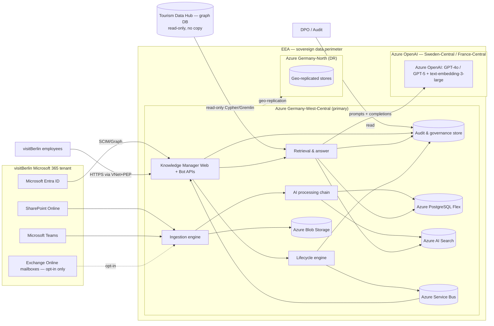
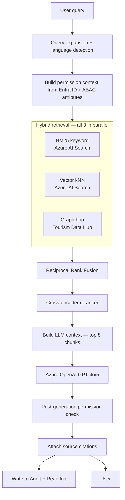

# Architecture — visitBerlin Knowledge Manager
### Klaravex GmbH — technical companion to the proposal

**Status:** Draft for project-team review
**Companion to:** `../proposal/proposal.md`, `../_source/visitberlin-concept-v0.1.md`
**Date:** 2026-06-27

---

## 1. Purpose of this document

This document describes the technical architecture Klaravex proposes for the visitBerlin Knowledge Manager. It is the technical companion to `../proposal/proposal.md`. Where the proposal commits to a position (notably in §4 function mapping and §6 unresolved-point resolutions), this document describes the technical implementation that delivers it, and records the architectural decision in an ADR under `./adr/`.

Audience: visitBerlin IT lead, DPO, and procurement. Mid-level technical literacy assumed; we explain the moving parts but do not re-derive cloud-architecture first principles.

---

## 2. System context



The sovereign perimeter is the EEA. The Microsoft 365 tenant is the source-of-truth for users and roles (Entra ID) and the primary content origin (SharePoint, Teams, and — opt-in only — Exchange mailboxes). The Tourism Data Hub is connected read-only; nothing is copied into the Knowledge Manager. All Azure data-plane services are deployed in Germany-West-Central with cross-region replication to Germany-North for disaster recovery. Azure OpenAI is hosted in the nearest EEA region offering the required models (Sweden-Central or France-Central as of 2026), pending Azure OpenAI's expansion into Germany regions — migration path documented in ADR-0005 and `../compliance/data-residency.md`.

---

## 3. The five engines

The proposal §2 names five engines. Each is a logical system; some share Azure services for cost and operability reasons.

### 3.1 Ingestion engine

**Responsibilities:** receive content from all configured sources, normalise to a canonical content record, hand off to the AI processing chain.

**Sources and adapters:**

| Source | Mechanism | Notes |
| --- | --- | --- |
| Manual upload | Knowledge Manager Web — multipart POST to `/api/v1/content` | Virus scan via Azure Defender for Storage on the landing blob container before processing begins. Content-type validation against MIME and magic-byte signature. Max 100 MB per upload. |
| SharePoint Online | Microsoft Graph delta queries via change-notification webhooks | Subscription per configured site. Throttling-aware. Initial site sync uses Graph `delta` token. |
| Microsoft Teams | Microsoft Graph subscriptions on channel messages, files | Per channel inclusion list. Personal chats excluded by policy. |
| Exchange mailboxes | Microsoft Graph subscriptions on the configured mailbox | **Default: disabled.** Mailbox-by-mailbox opt-in. See ADR-0007 and proposal §6.7. Personal mailboxes excluded by policy. |
| Tourism Data Hub | Read-only Cypher/Gremlin queries via the data-hub adapter | No data copied; queried on demand at retrieval time. See ADR-0003. |
| In-platform notes | Direct UI form | Same pipeline as manual upload from `/api/v1/content`. |

**Canonical content record (simplified):**

```
ContentItem
├── id (UUIDv7)
├── source { type, source_id, ingested_at, last_seen_at }
├── original_blob { container, path, sha256, size, content_type }
├── extracted_text (cleaned, sanitised — see §3.2.2)
├── metadata { title, author, date_created, date_modified, responsible_unit, language }
├── ai_metadata { tags[], category, summary, language_detected, confidence_scores }
├── lifecycle { validity_until, status, content_owner_id, approver_id }
├── permissions { confidentiality_level, abac_attributes }
├── version_history[] (append-only)
└── audit_ref (link into Audit & governance store)
```

The canonical record lives in PostgreSQL. The original blob lives in Azure Blob Storage with object-lock enabled for the configured retention. The vectorised representation lives in Azure AI Search (see §3.3).

### 3.2 AI processing chain

The chain runs as a Service-Bus-driven pipeline of small workers. Each worker is idempotent and writes its output to PostgreSQL; on failure the message is dead-lettered for human inspection.

**Order of operations:**

1. **Extraction.** Apache Tika (containerised) or Azure Document Intelligence for PDF/Office. Output: plain text + structural metadata (headings, tables).
2. **Sanitisation.** Strip invisible text (white-on-white, zero-font-size, off-canvas), strip metadata fields known to carry hidden content. Implements proposal §6.2 control 1.
3. **Instruction-pattern flagging.** Small classifier (`distilbert-base-multilingual-cased`-equivalent fine-tuned on prompt-injection patterns) flags documents containing imperative directed-at-AI text. Runs **before** any LLM step so injected instructions cannot poison downstream tagging or summarisation. Flagged items are queued for Approver review regardless of Author preference; LLM-driven steps 7–8 are skipped until the Approver clears or quarantines the item. Implements proposal §6.2 control 2. **Throughput-protection (backpressure on the Approver queue):** classifier false-positive rate target ≤2 % on the validation corpus; per-Approver flagged-queue cap of 50 items pending, beyond which new flags are routed to a shared triage queue worked by the rota-on-call Approver group; bulk migrations (initial loader + admin batch upload) bypass this cap via a documented "migration mode" that buffers flagged items at 500/batch and pages a designated migration approver — preventing the Approver queue from becoming the system bottleneck under day-one load.
4. **Language detection.** fastText or Azure AI Language `detectLanguage`.
5. **Chunking.** Semantic chunking (target ~800 tokens per chunk, 100-token overlap) using a recursive-splitter aware of document structure (don't split mid-table, don't split mid-list).
6. **Embedding.** Azure OpenAI `text-embedding-3-large` (3072-dim). One vector per chunk. See ADR-0005.
7. **Tagging.** LLM-driven extraction against a controlled taxonomy seeded from initial migration and grown organically. Tags written back to PostgreSQL with confidence scores. Skipped for items flagged in step 3 until Approver clears.
8. **Summarisation.** Two outputs: a 2–3 sentence "card summary" for browse views, and a ~150-word "long summary" for the bot's context. Both stored in PostgreSQL. Skipped for items flagged in step 3 until Approver clears.
9. **Duplicate detection.** Cosine similarity of the document's mean-pooled embedding against existing items. Threshold default 0.85 (configurable per content type). Surfaces a suggestion to the Author at submission and notifies the existing Content Owner. Does **not** block publication. Implements proposal §6.4.
10. **Approval handoff.** Item moves to the Approver's queue for confidentiality-level assignment and publication sign-off.

**Failure handling.** Each step's output is committed before the next is enqueued. A retry policy with exponential backoff on Service Bus, three retries, then dead-letter. The Admin Console surfaces dead-lettered items with the stage and error.

### 3.3 Retrieval & answer engine

**Responsibilities:** answer a user's natural-language query with a permission-correct, source-cited response.

**Retrieval is hybrid** (ADR-0008):



**Permission filter at retrieval (ADR-0002).** The permission filter is applied to the search query, not after results are returned. Documents the user is not permitted to read are never embedded into the LLM context. The implementation in Azure AI Search uses a `filter` clause built from the user's Entra ID group membership (role axis) and ABAC attributes (confidentiality axis × responsible-unit attribute). This is the single most important security property of the system; it is also the most commonly-broken property in production RAG.

**Post-generation permission check.** Defence in depth. The LLM's answer is parsed for source citations; each cited source ID is re-checked against the user's permission context; any cited source the user lacks permission for triggers a regeneration without that source, or — if no permitted sources remain — an audit-logged "content filtered" message to the user.

**Review-due handling.** If the only matching sources are in status `Review due`, the bot answers with a caveat ("This information is under re-submission review by [Content Owner], last verified [date]"). If the only matching sources are `Outdated` or `Archived`, the bot refuses to answer and explains why. Implements proposal §6.1.

**Fallback behaviour.** On Azure OpenAI outage, the engine returns the top reranked sources with their pre-computed long-summaries and a user-visible notice that synthesis is unavailable. Implements proposal §6.9 fallback.

**Targets.**
- Latency: p50 < 3 s, p95 < 8 s, p99 < 15 s end-to-end (proposal §6.9).
- Hallucination rate: <2 % of answers contain a factual claim not supported by a cited source (proposal §6.9), measured on a weekly sample.

**End-to-end latency budget (p95 = 8 s).** The chain is streamed; user-perceived latency is time-to-first-token (TTFT). Two budgets are tracked: **(A) TTFT** (perceived) and **(B) full-answer wall-clock** (TTFT + completion stream + post-gen check + optional regenerate). The "headroom" row is a buffer, not consumed steady-state.

| # | Step | p95 budget | On TTFT path? | Notes |
| --- | --- | --- | --- | --- |
| 1 | Query understanding (intent + expansion) | 350 ms | yes | Single AOAI call, GPT-4o-mini class, ~150 input/40 output tokens |
| 2 | Permission context build (Entra ID group + ABAC resolve) | 100 ms warm / 300 ms cold | yes | Redis-cached per session; hit-rate target ≥95 % (see §3.3 permission cache) |
| 3 | Hybrid retrieval (BM25 ∥ vector ∥ graph-hop, parallel) | 1 200 ms (bounded by slowest fan-out) | yes | Per-mode budgets — BM25 ≤350 ms, vector kNN ≤600 ms, graph-hop ≤1 200 ms (depth ≤2, capped at 200 nodes, circuit-breaker at 900 ms); graph-hop only when intent-classified |
| 4 | RRF fusion | 20 ms | yes | In-process |
| 5 | Cross-encoder rerank (AI Search semantic ranker `semantic-ranker-v2`, top-50 → top-8, doc length capped 2 048 tokens, batch=50) | 400 ms | yes | Model SKU pinned; longer docs truncated before rerank |
| 6 | LLM context build | 30 ms | yes | Token-count and trim |
| 7 | LLM synthesis — time-to-first-token | 600 ms | yes | Streamed to client; **user-visible latency stops here** |
| **(A) TTFT subtotal** | **~2 700 ms** | | | **p50 target < 1 500 ms; p95 < 3 000 ms — well inside the 3 s p50 SLA in proposal §6.9.** |
| 8 | LLM synthesis — full completion stream (300–800 output tokens @ ~3–5 ms/token observed AOAI streaming) | 1 500 – 3 000 ms (modelled at 2 000 ms p95) | no — overlaps with user reading | User reads the prefix while remaining tokens stream |
| 9 | Post-generation permission check (runs **on completion**, citations re-checked against permission context) | 150 ms | no | Fires after full stream completes; blocks final-rendered marker only on violation |
| 10 | Audit write (Service Bus enqueue, awaited so client gets durable-write ack before final marker) | 20 ms | no | Documented as on critical path of the final marker, not of TTFT |
| **(B) Full-answer wall-clock, no regenerate** | **~4 870 ms** | | | Sum of steps 1–10 |
| 11 | Regenerate branch — second synthesis pass (TTFT 600 + completion 2 000 + post-gen 150) | 2 750 ms | no | Triggered <1 % of requests; offending source removed from context |
| **(B′) Full-answer wall-clock with regenerate** | **~7 620 ms** | | | Inside the 8 s p95 SLA |
| – | Buffer to 8 s p95 ceiling | ~380 ms | | Pure margin, not allocated to any step |

The streaming-first design means user-perceived latency is dominated by TTFT (step 7). The post-gen check (step 9) runs against the completed stream in parallel with the user reading the streamed prefix and only blocks the final-rendered marker if a violation forces cancellation. Steps 8–10 are on the wall-clock budget but not on TTFT.

**LLM streaming + post-flight verification.** Synthesis is streamed to the client over Server-Sent Events. The post-generation permission check runs on the completed stream; on violation, the client is signalled to discard the partial answer and the engine re-synthesises with the offending source removed. This keeps p50 TTFT under 1.5 s while preserving the post-gen safety property.

**Permission cache (Redis).** Permission context = (user OID, group membership snapshot, ABAC attribute snapshot). Cached per session under key `perm:{oid}:{groupsHash}` for the lower of (session TTL, 15 minutes). **Hit-rate target ≥95 %** at steady state; below 90 % triggers an SLO alert. Invalidation: (a) explicit pub/sub channel `perm:invalidate` is published by the Entra ID change webhook (group add/remove, role change) and by the Admin Console on attribute edits, consumers drop matching keys; (b) on each cache read the snapshot's group-list hash is compared to the live token's `groups` claim and the entry is discarded on mismatch; (c) hard TTL bounds staleness at 15 minutes even if both invalidation paths fail. **Redis degraded mode:** on Redis unavailability the cold path runs (≤300 ms p95) and a per-pod local LRU caches the last 1 000 entries for ≤60 s as a circuit-breaker stop-gap; the SLO alert fires after 60 s of Redis degradation.

### 3.4 Lifecycle engine

**Responsibilities:** track validity, drive re-submission, escalate, transition status.

The lifecycle engine is a scheduled worker reading PostgreSQL and writing status transitions and notifications back. Logic:

```
nightly_lifecycle_scan():
  for each item where status = 'Current' and validity_until < today:
    transition status -> 'Review due'
    schedule notification to content_owner via Teams adaptive card + email
    record audit event

  for each item where status = 'Review due' and now - review_due_at >= 14d and not reminded:
    send reminder to content_owner
    mark reminded
    record audit event

  for each item where status = 'Review due' and now - review_due_at >= 30d and not escalated:
    send escalation to approver
    mark escalated
    record audit event

  for each item where status = 'Review due' and now - review_due_at >= 60d:
    transition status -> 'Outdated'
    flag for administrator review
    record audit event
```

**Initial-migration staggering (proposal §6.5).** During the one-time initial migration, the migration tool assigns validity periods uniformly distributed across ±90 days of the configured default. The migration audit log records this exception explicitly.

### 3.5 Audit & governance store

**Responsibilities:** record what happened, in a form that satisfies the DPO and survives BSI C5 audit.

**Two-tier log (ADR-0004, proposal §6.3):**

- **Action log** — append-only, retained 7 years, immutable.
  Records *that* an event occurred: who, what action, when, against which content ID, which permission filter applied, which sources were cited (by ID), outcome.
  Does **not** record query text or answer text.
  Storage: PostgreSQL append-only partitioned table, archived monthly to immutable Blob Storage with object-lock.
- **Read log** — retained 90 days, automatically aged out.
  Records the query text, the answer text, the user, the timestamp.
  Storage: PostgreSQL with a daily TTL job.
  Purpose: support investigation, abuse investigation, hallucination sampling.

The read log's 90-day retention is the technical mechanism by which Knowledge Manager satisfies the "no copy of the Tourism Data Hub PII" principle in concept §7. The data-hub PII can transit through the read log for up to 90 days; this is justified under GDPR data-minimisation as the shortest retention compatible with operating the service.

---

## 4. Surfaces

### 4.1 Knowledge Manager Web

- Single-page application served from Azure App Service (Linux, Premium V3) behind Azure Front Door with WAF.
- Auth: OAuth2/OIDC against Entra ID. Session: HttpOnly cookies, SameSite=Lax, 8-hour idle timeout, 24-hour absolute timeout.
- API: REST, versioned `/api/v1`. Backend: **Bun on Linux containers** (Azure App Service custom container) per ADR-0010; .NET 8 retained as a carve-out for the Bot Framework handler if first-party SDK parity is not yet met. Toolchain (`bun install`, `bun build`, `bun test`) follows the repository's top-level `CLAUDE.md`.

### 4.2 Knowledge Manager Bot

- Bot Framework SDK, registered as an Azure Bot, surfaced in Microsoft Teams as a personal app + a tab.
- Also embedded in the Knowledge Manager Web as a sidebar.
- Both surfaces hit the same retrieval & answer engine.

### 4.3 Push channels

A single matching engine ranks new content against employee profiles and active subscriptions. Output is one of three deliveries per match:

- Email digest via Microsoft Graph `sendMail` (using the Knowledge Manager service mailbox), HTML + plain-text, with unsubscribe and frequency-edit links.
- Teams adaptive card via Microsoft Graph proactive messaging.
- In-platform notification via the SPA's notification centre.

The matching engine respects:
- Per-user frequency preferences (Instant / Several times a day / Daily / Weekly), per topic.
- Per-user rate limit (default: any bulk operation generating >50 notifications to a single user is collapsed to a single digest, regardless of Instant preference). Implements proposal §6.8.
- Permission filter (no push for content the recipient is not permitted to read).
- Status filter (no push for `Review due`, `Outdated`, or `Archived` items).

### 4.4 Admin Console

Browser app for Administrators only (Entra ID security group `KM-Administrators`). Surfaces: users & roles (read-mostly — actual assignment happens in Entra ID), source connections, lifecycle policy, audit log viewer (with `Action log` / `Read log` tabs), system health.

### 4.5 Content Owner workspace

A view within the main Web app, available to anyone in a `KM-ContentOwner-*` group. Surfaces: re-submission queue, "my content" view, drafts & approvals.

---

## 5. Identity & permission architecture

### 5.1 Identity

Entra ID is the single source of truth. The Knowledge Manager does not maintain its own user table; it caches a denormalised projection of Entra ID for performance (refreshed nightly via Microsoft Graph). Authentication is OIDC against the visitBerlin tenant.

### 5.2 Role axis — Entra ID security groups

Roles in concept §4.2 map 1:1 to Entra ID security groups (ADR-0006):

| Role | Entra ID group | Permission set |
| --- | --- | --- |
| Reader | `KM-Reader` (implicit — all employees) | Read approved content per permission filter, manage own subscriptions, use bot |
| Author | `KM-Author` | Reader + create content, submit for approval |
| Content Owner | `KM-ContentOwner-<area>` | Author + own content lifecycle within `<area>` |
| Approver | `KM-Approver-<area>` | Approve content within `<area>`, assign confidentiality level |
| Administrator | `KM-Administrator` | Full system administration |

Role assignment is managed in Entra ID; the Knowledge Manager UI does not write to Entra ID. This keeps role management in the IT team's existing process.

### 5.3 Confidentiality axis — ABAC attributes

Each content item carries:

- `confidentiality_level` ∈ {`public`, `internal`, `confidential`, `strictly_confidential`} (concept §4.1).
- `responsible_unit` — the org-chart unit owning the content.
- `additional_access_groups` — optional list of Entra ID groups granted explicit access (used for cross-cutting projects).

Each user carries (resolved from Entra ID):

- `clearance_max_level` — derived from job role and HR system, set by Administrator policy (not by the user).
- `member_of_groups` — Entra ID group memberships, refreshed per session.

**Access decision (evaluated per query, at retrieval time):**

```
permitted(item, user) =
  user.clearance_max_level >= item.confidentiality_level
  AND (
    item.confidentiality_level in {public, internal}
    OR user.member_of_groups intersects item.responsible_unit_group
    OR user.member_of_groups intersects item.additional_access_groups
  )
```

This boolean is rendered as a search-time `filter` clause against Azure AI Search, evaluated server-side, never returning forbidden content to the request thread.

---

## 6. Tourism Data Hub integration

**Posture:** read-only adapter, no copy, queried on demand at retrieval time, results cached only within the user's session (in-memory in the API process), never persisted to PostgreSQL or Blob Storage. ADR-0003.

**Adapter contract:**

```
DataHubAdapter
  + lookup_pois(filters) -> PoiList
  + lookup_bwc_partners(filters) -> PartnerList
  + lookup_stakeholder_contacts(filters) -> ContactList
```

The adapter uses the data hub's read-only Cypher (or Gremlin) endpoint with a service account scoped to read-only permissions. Network: private endpoint over Azure VNet peering or VPN to wherever the data hub is hosted; the data hub is not exposed to the public Internet from the Knowledge Manager side.

**During retrieval (§3.3),** the engine performs a graph-hop in parallel with vector and BM25 retrieval. The hop is triggered by intent classification on the query (e.g. "who is the BWC partner in X" → hop into BWC partner lookup). Returned graph results are included in the retrieval candidate set with a clear source label "Tourism Data Hub (read-only)" and never written to PostgreSQL.

**Audit:** every hop is recorded in the action log (which queries were made against the hub on whose behalf, returning how many records), without recording the returned data itself.

---

## 7. Microsoft 365 ingestion details

### 7.1 SharePoint

- Graph subscription per configured site. Webhook target is an Azure Function in the ingestion engine.
- Initial sync uses `delta` token to enumerate site contents, then switches to change notifications.
- Per-site inclusion list managed in Admin Console; excluded sites never enumerated.
- Files in the site library are downloaded to the staging blob container for ingestion. Original SharePoint URL retained for "view source" link in the UI.
- Throttling: respect Graph's `Retry-After`; exponential backoff.

### 7.2 Teams

- Graph subscription per configured channel for messages and files.
- Personal chats excluded by policy (not technically supported by ingestion).
- Inclusion list managed in Admin Console.

### 7.3 Mailbox connector — opt-in only

- **Default: disabled.** No mailbox subscribed.
- Per-mailbox opt-in by Administrator after DPO sign-off. Implements proposal §6.7.
- Eligible: shared / functional mailboxes only. Personal mailboxes blocked at the Admin Console level.
- Filters applied at ingestion:
  - Drafts, calendar items, contacts: excluded.
  - Sent items: excluded by default, optional opt-in per mailbox.
  - BCC headers: stripped before AI processing.
  - External senders: ingested only if sender domain is on the per-mailbox allowlist; otherwise the message is logged-but-discarded.

### 7.4 Entra ID sync

- Daily SCIM-style projection via Microsoft Graph: users, groups, group memberships, org-chart fields.
- Synced fields are read-only in the Knowledge Manager; users see them in their profile.
- Overlay fields (focus areas, subscribed topics, notification preferences) are user-editable in the Knowledge Manager.

---

## 8. Storage layer

| Service | SKU (indicative) | Purpose |
| --- | --- | --- |
| Azure PostgreSQL Flexible Server | Memory-Optimised E4ds_v5, HA-enabled, geo-redundant backup | Canonical content records, ai_metadata, permissions, lifecycle, audit logs, taxonomy |
| Azure AI Search | Standard S2 with semantic ranker | Vector index (3072-dim, HNSW), BM25 index, hybrid scoring |
| Azure Blob Storage | Standard ZRS in Germany-West-Central + Standard GRS to Germany-North | Originals, archived audit log partitions (immutable, object-lock) |
| Azure Service Bus | Premium (single Messaging Unit baseline) | AI processing chain pipeline, lifecycle notifications |
| Azure Cache for Redis | Premium P1 | Session permission cache, taxonomy cache |

All data-plane services are in Germany-West-Central. Blob Storage is geo-replicated to Germany-North. PostgreSQL geo-replica in Germany-North for DR (cold standby; RPO ≤ 15 min, RTO ≤ 4 h).

---

## 9. Networking

- One VNet per environment (dev / staging / prod). Production VNet in Germany-West-Central with peered VNet in Germany-North for DR.
- All data-plane Azure services (PostgreSQL, AI Search, Blob, Service Bus, Redis, Bot framework backend) exposed only via private endpoints. No public ingress on data plane.
- User ingress: Azure Front Door (Premium tier) → WAF policy (OWASP Core Rule Set) → Application Gateway → App Service. Front Door is the single public surface.
- M365 Graph egress: via Azure Front Door's NAT pool (static egress IPs for Microsoft tenant conditional-access lists).
- Azure OpenAI egress: via private endpoint to the Sweden-Central / France-Central instance using Microsoft backbone networking (Azure private link).
- Tourism Data Hub: private peering or site-to-site VPN to wherever the data hub is hosted.

---

## 10. Observability

- Azure Monitor + Application Insights for traces, metrics, logs.
- Structured logging (JSON) throughout, with a correlation ID per request that links into audit events.
- Bot quality dashboards: latency percentiles, source-coverage rate, fallback-mode invocations, post-generation permission-check rejection rate, hallucination-sample review results.
- Lifecycle dashboards: count of `Review due`, count escalated to Approver, count auto-transitioned to `Outdated`.
- Push dashboards: notifications sent per channel, rate-limit collapses applied, in-app feedback breakdown.
- Alerting: Azure Monitor alerts to Klaravex on-call rotation (Microsoft Teams + email) for SLO breaches.

---

## 11. Deployment

- **IaC:** Bicep (ADR-0008). All Azure resources defined as code; environment is reproducible from the repo.
- **CI/CD:** GitHub Actions Enterprise. Pipelines: `lint → test → security-scan (Defender for DevOps) → build → deploy-dev → integration-tests → manual gate → deploy-staging → smoke-tests → manual gate → deploy-prod`. Manual gates are governance-board-approved.
- **Environments:** dev (shared, ephemeral data), staging (synthetic data only), prod (live data). Staging mirrors prod topology at smaller SKUs.
- **Secrets:** Azure Key Vault, per-environment. No secrets in source. CI/CD authenticates via federated credentials (no long-lived service-principal keys).

---

## 12. Disaster recovery

| Scenario | Detection | Recovery | RPO | RTO |
| --- | --- | --- | --- | --- |
| Single AZ failure in Germany-West-Central | Azure Front Door health probes + Azure Monitor | Automatic failover within region (zone-redundant services) | 0 | <5 min |
| Germany-West-Central regional failure | Azure Monitor cross-region health checks + on-call paging | Manual cutover to Germany-North (DNS + Bicep `whatif` against prepared DR stack) | <15 min | <4 h |
| Azure OpenAI outage in primary region | API client circuit breaker on Azure OpenAI failures | Engine degrades to no-LLM fallback (see §3.3); user-visible notice | n/a | n/a (degrade-in-place) |
| Data hub outage | Adapter timeout | Bot answers from Knowledge Manager content only, with a notice that hub data is unavailable | n/a | n/a |

DR runbook is exercised quarterly during pilot operation (proposal phase 3) and twice yearly thereafter.

---

## 13. Cross-walk to the concept and proposal

| Concept § | Proposal § | Architecture § |
| --- | --- | --- |
| §3.1 Adding & capturing | §4.1 | §3.1, §7 |
| §3.2 Employee profile | §4.2 | §5.1, §7.4 |
| §3.3 Subscriptions | §4.3 | §4.3 |
| §3.4 Frequency | §4.4, §6.8 | §4.3 |
| §3.5 Bot | §4.5, §6.1, §6.9 | §3.3, §4.2 |
| §4 Permission model | §4.6 | §5 |
| §5 Lifecycle | §4.7, §6.5 | §3.4 |
| §6 Further functions | §4.8, §6.4 | §3.2 (step 8), §4 |
| §7 Data protection | §4.9, §6.2, §6.3, §6.7 | §3.5, §5, §6, §7.3 |
| §8 Open points | §6 | (no direct mapping — open points resolved in proposal) |

---

## 14. ADR index

| ADR | Decision |
| --- | --- |
| `adr/adr-0001-azure-germany-region.md` | Primary region Germany-West-Central, DR Germany-North |
| `adr/adr-0002-permission-filter-at-retrieval.md` | Permission filter applied at retrieval, not post-hoc |
| `adr/adr-0003-no-copy-tourism-data-hub.md` | Data hub read-only adapter with session-scoped cache only |
| `adr/adr-0004-audit-log-two-tier.md` | Action log 7 yr / read log 90 days |
| `adr/adr-0005-azure-openai-not-openai.md` | Azure OpenAI in EEA region; no direct OpenAI |
| `adr/adr-0006-entra-id-for-roles.md` | Roles as Entra ID security groups |
| `adr/adr-0007-mailbox-opt-in-only.md` | Mailbox ingestion default disabled, opt-in per mailbox |
| `adr/adr-0008-hybrid-retrieval.md` | BM25 + vector + graph hop with reranker |
| `adr/adr-0009-bicep-over-terraform.md` | IaC in Bicep for Azure-only deployment |
| `adr/adr-0010-backend-runtime-bun.md` | Backend runtime: Bun on Linux containers (default), .NET 8 carve-out for Bot Framework |

---

*End of architecture document.*
