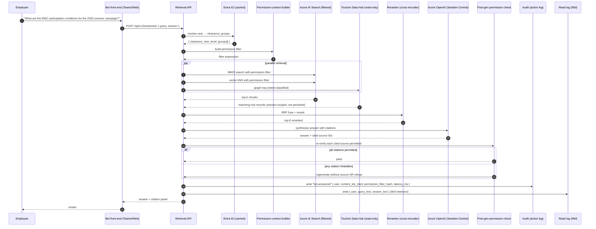
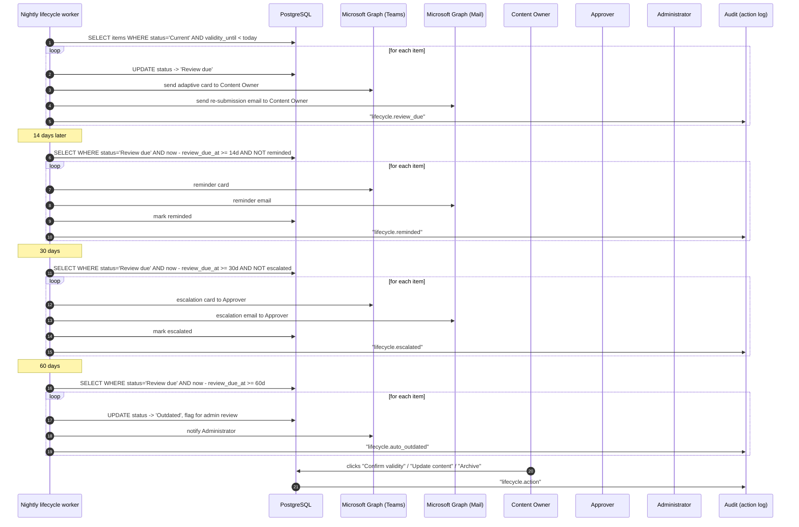

# Data flows — visitBerlin Knowledge Manager
### Klaravex GmbH — companion to `architecture.md`

This document narrates the three data flows that matter most for understanding how the system behaves at runtime. Read alongside `architecture.md` §3 (the five engines) and the ADRs under `adr/`.

---

## Flow A — New document uploaded

**Trigger:** an Author drags a Word document into the upload zone of the Knowledge Manager Web app.

```mermaid
sequenceDiagram
    autonumber
    participant U as Author (UI)
    participant API as KM Web API
    participant BLOB as Blob (landing)
    participant DEF as Defender for Storage
    participant SB as Service Bus
    participant EXT as Extraction worker
    participant SAN as Sanitisation worker
    participant AI as Azure OpenAI
    participant PG as PostgreSQL
    participant SRCH as Azure AI Search
    participant APPR as Approver queue
    participant AUD as Audit (action log)

    U->>API: POST /api/v1/content (multipart)
    API->>BLOB: PUT to landing container
    API->>AUD: write "content.uploaded"
    BLOB->>DEF: virus scan (async)
    DEF-->>SB: enqueue "scan.clean" or "scan.infected"
    Note over SB: infected → dead-letter, notify Author
    SB->>EXT: scan.clean → extract
    EXT->>PG: write extracted_text
    EXT->>SB: enqueue "sanitise"
    SB->>SAN: sanitise
    SAN->>PG: write sanitised_text + flags
    SAN->>SB: enqueue "language-detect"
    Note over SB: chain: language → chunk → embed → tag → summarise → dedupe → injection-flag
    SB->>AI: embed chunks (text-embedding-3-large)
    AI-->>SB: vectors
    SB->>SRCH: upsert chunk vectors + metadata
    SB->>AI: tag + summarise (GPT-4o/5)
    AI-->>SB: tags, summaries
    SB->>PG: write ai_metadata
    SB->>APPR: queue for approval (assign confidentiality, sign off)
    APPR->>PG: status -> Current; publish
    PG->>AUD: write "content.published"
    APPR->>SB: enqueue "push-fan-out"
    Note over SB: push fan-out evaluates per-user subscriptions, applies rate-limit (proposal §6.8), delivers via email/Teams/in-platform
```

### Key properties

- **Virus scan blocks the pipeline.** Infected documents are dead-lettered and the Author is notified; the file is moved to a quarantine container with object-lock for 30 days.
- **Sanitisation runs before any AI step.** Invisible text (white-on-white, zero-font-size, off-canvas), stripped before extraction is handed off. The hidden-instruction classifier runs at this stage too; flagged items are tagged for mandatory Approver review (proposal §6.2 control 2).
- **Idempotency.** Every worker reads-from and writes-to PostgreSQL by `content_id`. A re-delivered Service Bus message is a no-op if the worker's output already exists.
- **Backpressure.** Service Bus Premium with two Messaging Units. If embedding throughput falls behind, the queue grows; alerts fire at queue depth > 10k items or message age > 1 hour.
- **Push fan-out is the last step.** It runs after `status -> Current`. Items in `Review due`, `Outdated`, or `Archived` never fan-out. Per-user rate-limit collapses bulk operations into single digests (proposal §6.8).

### What the audit log records (action log)

- `content.uploaded` (user, content_id, source, size, sha256)
- `content.scanned` (content_id, scan outcome)
- `content.published` (user=Approver, content_id, confidentiality_level)
- `push.delivered` (recipient, content_id, channel, frequency_bucket)
- *Does not record* the document text or any AI output.

---

## Flow B — Bot question answered

**Trigger:** an employee types a question into the bot, either in the Teams personal app or in the Web app's sidebar.



### Key properties

- **Permission filter at retrieval, not after.** Documents the user lacks permission for are never returned by Azure AI Search. They never enter the LLM context. They cannot be cited. ADR-0002.
- **Defence in depth.** The post-generation permission check is a second line; if it fires, that is itself an audit event indicating either a permission-context bug or a forbidden inference path — both worth investigating.
- **Tourism Data Hub results are session-scoped.** Hub records returned during this query are never written to PostgreSQL or Azure AI Search. They live in the API process memory for the duration of the request, are surfaced to the user, and are dropped. The action log records that the hop happened (and how many records returned) but not the records' content.
- **Review-due caveat.** If the only matching sources are `Review due`, the bot answers with the caveat from proposal §6.1. If only `Outdated` or `Archived`, the bot refuses.
- **Fallback on Azure OpenAI outage.** If `AOAI` returns 5xx or times out (>15 s), the API returns the top-3 reranked sources with their pre-computed long-summaries and the visible notice "Synthesis is currently unavailable — here are the most relevant sources." Audit event `bot.fallback`.
- **Latency budget.** Retrieval ≤ 2 s, rerank ≤ 500 ms, AOAI ≤ 5 s, post-check ≤ 200 ms. p95 target end-to-end 8 s.

### What the action log records (vs the read log)

| Field | Action log (7 yr) | Read log (90 d) |
| --- | --- | --- |
| User ID | yes | yes |
| Timestamp | yes | yes |
| Query text | no | yes |
| Answer text | no | yes |
| Cited source IDs | yes | yes |
| Permission filter hash | yes | no |
| Latency, fallback flag | yes | yes |
| Hub records (content) | no | indirectly, via answer text |

The 90-day read-log retention is the technical mechanism that resolves the contradiction in concept §7 (no-copy data hub) vs §5.3 (audit logging). See proposal §6.3 and ADR-0004.

---

## Flow C — Lifecycle re-submission

**Trigger:** a nightly job; a content item's `validity_until` date has passed.



### Key properties

- **No item sits in `Review due` forever.** The 60-day auto-transition to `Outdated` closes the gap in concept §5.1 (no defined fallback if review is ignored). Proposal §6.5.
- **Initial-migration staggering.** During the one-time content migration, the migrator assigns `validity_until` values uniformly distributed across ±90 days of the configured default per content-type. This avoids the synchronised expiry wave at the 12-month mark. The migration audit log records this as a one-time exception.
- **Push impact.** As soon as status leaves `Current`, the push matcher excludes the item. The bot continues to surface it during `Review due` with a caveat (Flow B); excludes it from `Outdated` and `Archived`.
- **Versioning.** When a Content Owner updates content during re-submission, a new version is appended; the old version is retained and accessible from the item's "Versions" tab.

### Escalation tuning

The 14 / 30 / 60-day thresholds are configurable per content-type via the Admin Console lifecycle-policy editor. The defaults are the recommendation; a content-type like "Annual MICE strategy" may warrant a 30 / 60 / 120 schedule, while "Daily ops bulletin" may warrant 3 / 7 / 14. Defaults are agreed during proposal phase 1 (open-points workshops).

---

## What is *not* shown in these flows

- **Initial sync** of a SharePoint site or Teams channel uses Microsoft Graph `delta` enumeration on first connection. The same downstream pipeline as Flow A handles each item; the only difference is volume control (max parallel ingestions cap to avoid Graph throttling).
- **Profile sync** runs as a separate nightly job that projects Entra ID into the cached user table; described in `architecture.md` §7.4.
- **DR cutover** is documented in the runbook in `architecture.md` §12, not here.

---

*End of data-flow document.*
